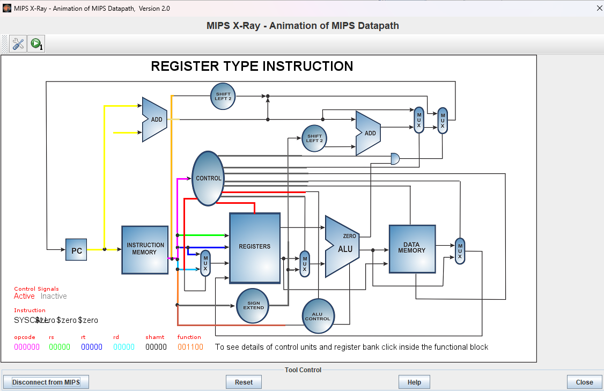
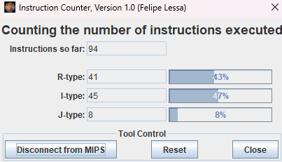
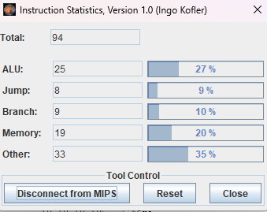
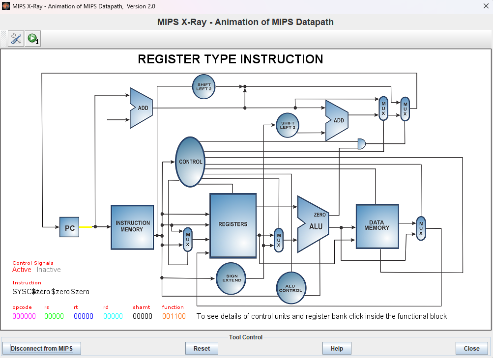
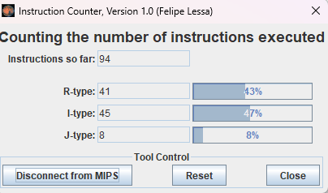
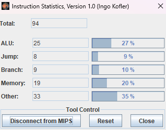

# Informe de Laboratorio: Estructura de Computadores

**Nombre del Estudiante:** Ricardo Urueta 
**Fecha:** 02/03/2026  
**Asignatura:** Estructura de Computadores
 
**Enlace del repositorio en GitHub:** [agregar enlace Aquí]  
 

---

## 1. Análisis del Código Base

### 1.1. Evidencia de Ejecución
Adjunte aquí las capturas de pantalla de la ejecución del `programa_base.asm` utilizando las siguientes herramientas de MARS:
*   **MIPS X-Ray** (Ventana con el Datapath animado).
> 
*   **Instruction Counter** (Contador de instrucciones totales).

*   **Instruction Statistics** (Desglose por tipo de instrucción).



### 1.2. Identificación de Riesgos (Hazards)
Completa la siguiente tabla identificando las instrucciones que causan paradas en el pipeline:

| Instrucción Causante | Instrucción Afectada | Tipo de Riesgo (Load-Use, etc.) | Ciclos de Parada |
|----------------------|----------------------|---------------------------------|------------------|
| `lw $t6, 0($t5)`     | `mul $t7, $t6, $t0`  | Load-Use                        |       2          |
|  `mul $t7, $t6, $t0` | `addu $t8, $t7, $t1` | RAW (mul)                       |        1         |

### 1.2. Estadísticas y Análisis Teórico
Dado que MARS es un simulador funcional, el número de instrucciones ejecutadas será igual en ambas versiones. Sin embargo, en un procesador real, el tiempo de ejecución (ciclos) varía. Completa la siguiente tabla de análisis teórico:

| Métrica | Código Base | Código Optimizado |
|---------|-------------|-------------------|
| Instrucciones Totales (según MARS) |      94       |         94          |
| Stalls (Paradas) por iteración |       3      |          1         |
| Total de Stalls (8 iteraciones) |       24      |        8           |
| **Ciclos Totales Estimados** (Inst + Stalls) |     118        |         102          |
| **CPI Estimado** (Ciclos / Inst) |       1.26      |          1.09         |

---

## 2. Optimización Propuesta

### 2.1. Evidencia de Ejecución (Código Optimizado)
Adjunte aquí las capturas de pantalla de la ejecución del `programa_optimizado.asm` utilizando las mismas herramientas que en el punto 1.1:
*   **MIPS X-Ray** (Ventana con el Datapath animado).
> 
*   **Instruction Counter** (Contador de instrucciones totales).

*   **Instruction Statistics** (Desglose por tipo de instrucción).



### 2.2. Código Optimizado
Pega aquí el fragmento de tu bucle `loop` reordenado:

```asm
# Pega tu código aquí
```

### 2.2. Justificación Técnica de la Mejora
Explica qué instrucción moviste y por qué colocarla entre el `lw` y el `mul` elimina el riesgo de datos:
> [Tu explicación aquí]

---

## 3. Comparativa de Resultados

| Métrica | Código Base | Código Optimizado | Mejora (%) |
|---------|-------------|-------------------|------------|
| Ciclos Totales |             |                   |            |
| Stalls (Paradas) |             |                   |            |
| CPI |             |                   |            |

---

## 4. Conclusiones
¿Qué impacto tiene la segmentación en el diseño de software de bajo nivel? ¿Es siempre posible eliminar todas las paradas?
> [Tus conclusiones aquí]
